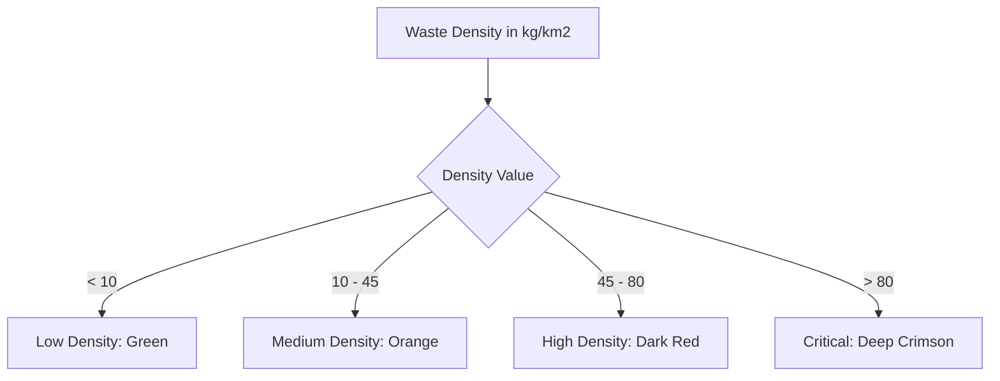

# Sprint Features Implementation Plan

This document outlines the technical design, requirements, and step-by-step instructions to implement the next set of interactive map and database features for the Oceaniq platform.


## 2. Configure Dataset to the Map

### Goal
Load and render official datasets (Verified Observations, Citizen Reports, and ML Estimates) on the Mapbox canvas using GeoJSON sources and custom layers.

### Technical Design
- Define a structured TypeScript interface for map points.
- Load the dataset dynamically and feed it to Mapbox as a GeoJSON FeatureCollection.
- Render different sources with distinctive layers:
  - **Points**: Circle layer with color coding matching their category.
  - **Heatmap**: Density-based heatmap layer for ML Estimates.
  - **Polygons**: Fills and borders showing monitoring boundaries.

### Implementation Steps
- Transform raw coordinates list to GeoJSON format:
  ```typescript
  const geojson: GeoJSON.FeatureCollection = {
    type: 'FeatureCollection',
    features: mapPoints.map(point => ({
      type: 'Feature',
      geometry: { type: 'Point', coordinates: [point.lng, point.lat] },
      properties: { ...point }
    }))
  };
  ```
- Use Mapbox `addSource` and `addLayer` during map loading:
  ```typescript
  map.addSource('waste-points', { type: 'geojson', data: geojson });
  map.addLayer({
    id: 'waste-circles',
    type: 'circle',
    source: 'waste-points',
    paint: {
      'circle-radius': ['interpolate', ['linear'], ['zoom'], 5, 4, 15, 12],
      'circle-color': [
        'match',
        ['get', 'type'],
        'observation', '#10b981', // green
        'citizen', '#f59e0b', // orange
        'ml', '#ef4444', // red
        '#ccc'
      ]
    }
  });
  ```

---

## 3. Set Up Ground Waste Categories with Details

### Goal
Expand the simple waste categories into a comprehensive, hierarchical database taxonomy to match standard debris reporting protocols.

### Waste Categories Schema Reference

| Code | Group Name | Item ID | Item Name |
| :--- | :--- | :--- | :--- |
| **A** | **MOST LIKELY TO FIND ITEMS** | A1 | Cigarette Butts |
| | | A2 | Food Wrapper (candy, chips, etc) |
| | | A3 | Take Out/Away Containers (Plastic) |
| | | A4 | Take Out/Away Containers (Foam) |
| | | A5 | Bottle Caps (Plastic) |
| | | A6 | Bottle Caps (Metal) |
| | | A7 | Lids (Plastic) |
| | | A8 | Straws/Stirrers |
| | | A9 | Fork, Knives, Spoons |
| | | A10 | Beverage Bottles (Plastic) |
| | | A11 | Beverage Bottles (Glass) |
| | | A12 | Beverage Cans |
| | | A13 | Grocery Bags (Plastic) |
| | | A14 | Other Plastic Bags |
| | | A15 | Paper Bags |
| | | A16 | Cups & Plates (Paper) |
| | | A17 | Cups & Plates (Plastic) |
| | | A18 | Cups & Plates (Foam) |
| **B** | **FISHING GEAR** | B1 | Fishing Buoys, Pots & Traps |
| | | B2 | Fishing Net & Pieces |
| | | B3 | Rope (1 yard/meter = 1 piece) |
| | | B4 | Fishing Line (1 yard/meter = 1 piece) |
| **C** | **PACKAGING MATERIALS** | C1 | 6-Pack Holders |
| | | C2 | Other Plastic/Foam Packaging |
| | | C3 | Other Plastic Bottles (oil, bleach, etc) |
| | | C4 | Strapping Bands |
| | | C5 | Tobacco Packaging/Wrap |
| **D** | **PERSONAL HYGIENE** | D1 | Condoms |
| | | D2 | Diapers |
| | | D3 | Syringes |
| | | D4 | Tampons/Tampon Applicators |
| **E** | **OTHER TRASH** | E1 | Appliances (refrigerators, washers, etc) |
| | | E2 | Balloons |
| | | E3 | Cigar Tips |
| | | E4 | Cigarette Lighters |
| | | E5 | Construction Materials |
| | | E6 | Fireworks |
| | | E7 | Tires |
| **F** | **TINY TRASH (< 2.5 CM)** | F1 | Foam Pieces |
| | | F2 | Glass Pieces |
| | | F3 | Plastic Pieces |

### Implementation Steps
1. Create a category model file `src/types/waste.ts` defining these groups and items.
2. In the report submission form and filters sidebar, replace simple selectors with grouped select dropdowns or tab-based selectors allowing users to filter by Group (e.g. "Fishing Gear") or by detailed Item (e.g. "Fishing Net & Pieces").

---

## 4. Debris Density Heatmap & Circle Legending

### Goal
Visualize the density of debris at coordinates using color gradients (yellow/orange to deep red) and add a visual legend detailing levels of waste concentration.



### Technical Design
- **Circle Map Styling**: Use Mapbox paint properties with interpolation expressions based on the `wasteDensity` property.
- **Debris Legend Panel**: A floating panel on the bottom-right explaining the density color thresholds:
  - **Low Density (<10 kg/km²)**: Greenish Cyan (#0ea5e9)
  - **Medium Density (10-45 kg/km²)**: Yellow/Orange (#f59e0b)
  - **High Density (45-80 kg/km²)**: Strong Orange/Red (#ea580c)
  - **Critical Density (>80 kg/km²)**: Deep Crimson/Red (#ef4444)

### Implementation Steps
- Configure circle marker styling in [MapCanvasMapbox.tsx](file:///c:/Oceaniq/src/app/interactive-map/components/MapCanvasMapbox.tsx):
  ```typescript
  map.addLayer({
    id: 'waste-circles',
    type: 'circle',
    source: 'waste-points',
    paint: {
      'circle-color': [
        'interpolate',
        ['linear'],
        ['get', 'wasteDensity'],
        0, '#0ea5e9',    // low
        20, '#f59e0b',   // medium
        50, '#ea580c',   // high
        80, '#ef4444'    // critical
      ],
      'circle-opacity': 0.85,
      'circle-stroke-width': 1.5,
      'circle-stroke-color': '#ffffff'
    }
  });
  ```
- Build a premium glassmorphic legend container positioned overlays on the Map.
